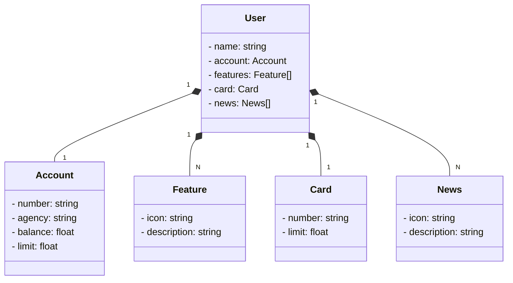

Java RESTful API criada para o SDW 2023. Esta API também conta com um banco de dados H2 e uma interface Swagger para controle de endpoints.

## Diagrama de Classes

```mermaid
classDiagram
  class User {
    - name: string
    - account: Account
    - features: Feature[]
    - card: Card
    - news: News[]
  }

  class Account {
    - number: string
    - agency: string
    - balance: float
    - limit: float
  }

  class Feature {
    - icon: string
    - description: string
  }

  class Card {
    - number: string
    - limit: float
  }

  class News {
    - icon: string
    - description: string
  }

  User "1" *-- "1" Account
  User "1" *-- "N"Feature
  User "1" *-- "1" Card
  User "1" *-- "N" News
```
