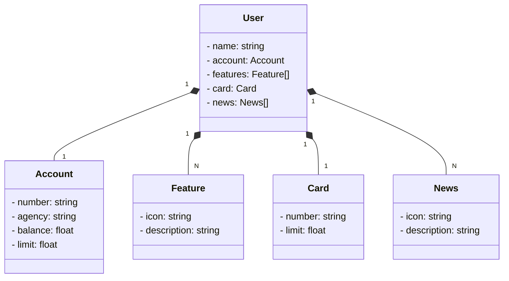

Java RESTful API criada para o SDW 2023. A aplicação utiliza o framework Spring Boot, um banco de dados H2 em memória e incorpora a interface Swagger para facilitar o controle e documentação dos endpoints.

# Pré-requisitos
Certifique-se de ter o Java e o Maven instalados em sua máquina.

## Diagrama de Classes

